# Azure App Service Walkthrough

[Back to Index](README.md)

## App instrumentation with Application Insights

Ideally, we'd like to have a very clear picture how our users experience our app: 

- how fast the pages load
- any exceptions they might encounter
- which features they are using the most / least.

For example, if you browse the demo application a little, you might notice that the **My Metrics** link (`/MyMetrics/Calculate`) throws an exception:

```
Non-static method requires a target. 
```

Wouldn't be great to find out about a user encountering that exception just as it happens, and also get as much context about their work up to that point, so we can fix that even before they reach our tech support?

### Enable Application Inisghts

In Visual Studio, find the **Quick Launch** bar and search for **Application Insights**. 
Select `View -> Toolbars -> Application Insights` to add the Application Insights toolbar.

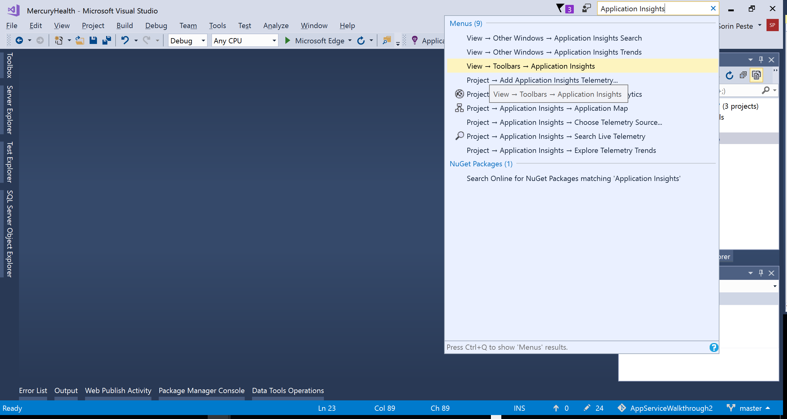

Then select the `MercuryHealth.Web` project, and from the toolbar select `Application Insights -> Add Application Insights`.

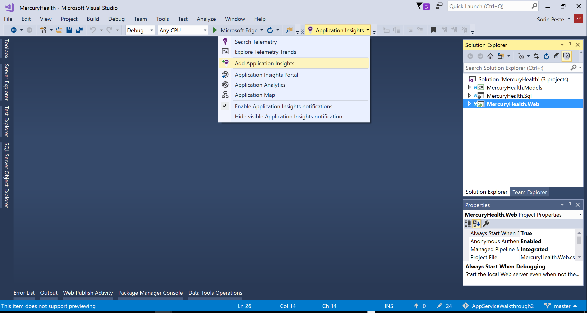

In the Application Insights Configuration wizard, click **Configure settings** and create a new App Insights resource. To keep everything tidy, use the same Resource Group the App Service and SQL Server are in.

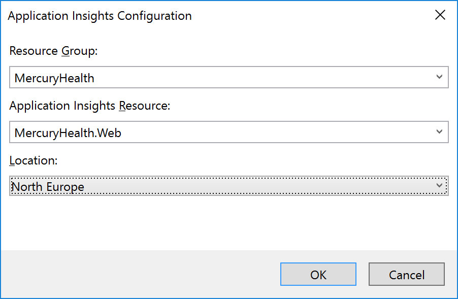

Once the wizard finishes, you'll have provisioned the new App Insights resource, and configured your web application to use it.

> NOTE: To see exactly what has been changed in the application code and configuration, run `git status`. You will see that a few files have been changed:
> - The `Views/Shared/_Layout.cshtml` file has [client instrumentation](https://docs.microsoft.com/en-us/azure/application-insights/app-insights-javascript) added to it. 
> - The `packages.config` file now contains references to [Application Insights SDK packages](https://www.nuget.org/packages?q=Microsoft.ApplicationInsights). 
> - The `App_Start/FilterConfig.cs`contains code to log exceptions to App Insights, by using the above-mentioned SDK. 
> - The `Web.config` file contains references to the `ApplicationInsightsWebTracking` HTTP module.
> - The `ApplicationInsights.config` file contains your unique instrumentation key.

There is also some [custom event tracking](https://docs.microsoft.com/en-us/azure/application-insights/app-insights-api-custom-events-metrics) code in the application, which is currently commented out. 

Open the `Utilities/TelemetryClientHelper.cs` file in the web project, and remove the code comments in the `TrackEvent` method:

```csharp
        public static void TrackEvent(string description)
        {
            // Uncomment these lines to track custom events.

            var telemetry = new Microsoft.ApplicationInsights.TelemetryClient();
            telemetry.TrackEvent(description);
        }
```

Save the file, and build the `MercuryHealth.Web` project.

Now let's push the changes to Staging, as we've learned in the [previous chapter](ContinuousDelivery.md).

```
git add src

git commit -m "Added App Insights"

git push azure master
```

Once it's pushed to Staging, you can start browing the web application (Staging slot). Browse around a bit to generate some telemetry.

> NOTE: It will take 1-2 minutes for telemetry to be viewable in App Insights.

Now let's view some of the telemetry that App Insights has collected from the app.

### Telemetry inspection

In the [Azure portal](http://portal.azure.com/), navigate to your App Service, click **Application Insights**, then **View More in Application Insights**:

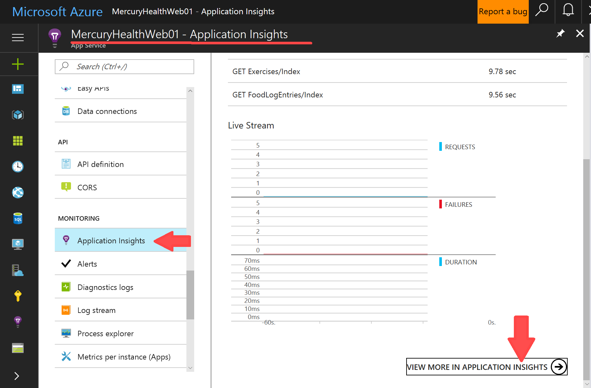

You will be taken to the main Application Insights dashboard:

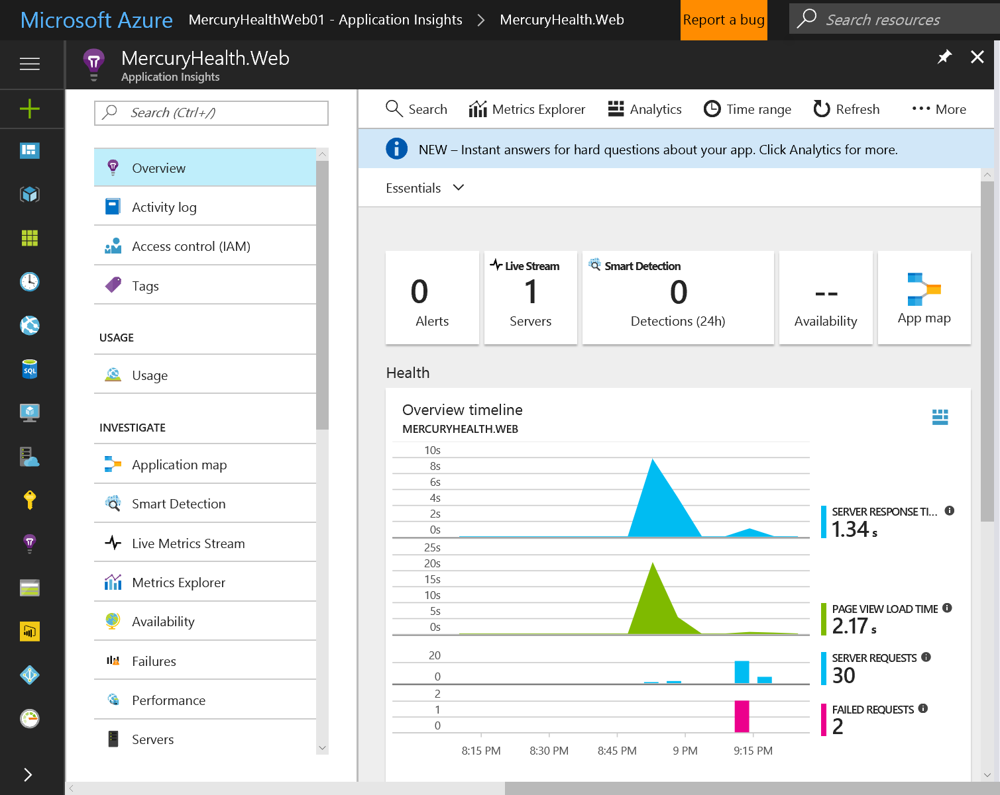

Let's take a short tour of some of the most interesting features of App Insights.

#### Live Streaming data

Click the **Live Stream** tile to get a glimpse of live telemetry. Click though the web app (in the Staging slot) to view the various graphs ramp up.

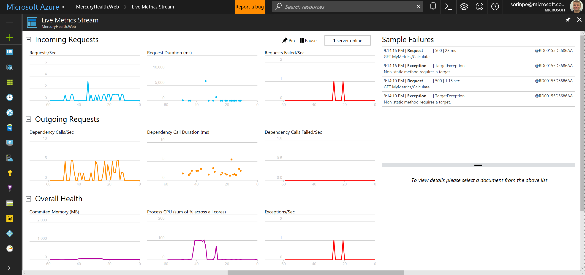

The data is split into the following sections:

1. Incoming Requests - made by the users to the app. This includes requests/sec, duration, and failures.
2. Outgoing Requests - made by the app to external dependencies, like databases or REST services. Same as above, you get rate, duration, and failures.
3. Overall Health - server RAM, CPU, and exceptions.

Now go back to the main Application Insights dashboard.

#### Application map

Click the **App map** tile. You will see a graphical representation of your solution.

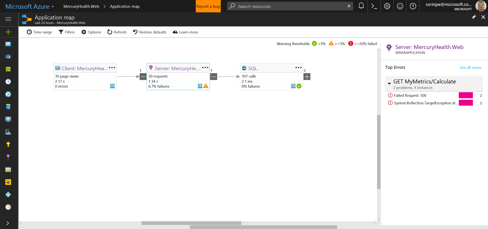

Our app has three components:

- the client (browser)
- the web application
- the database

Feel free to click each tile and see the errors and additional information displayed.

You can also adjust the thresholds for Warnings and Errors, by clicking the **Options** link in the menu, as you can see from the image below:

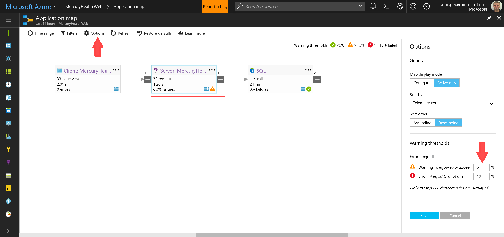

Clicking on each component's `...` menu will bring up the option to view the related metrics for each component.

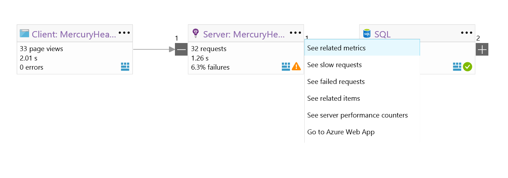

#### Investigating app failures

Now let's take a look at those failures that App Map has reported for the Web app.

Click the `...` menu for the **Server: MercuryHealth.Web** app and select **See failed requests**.

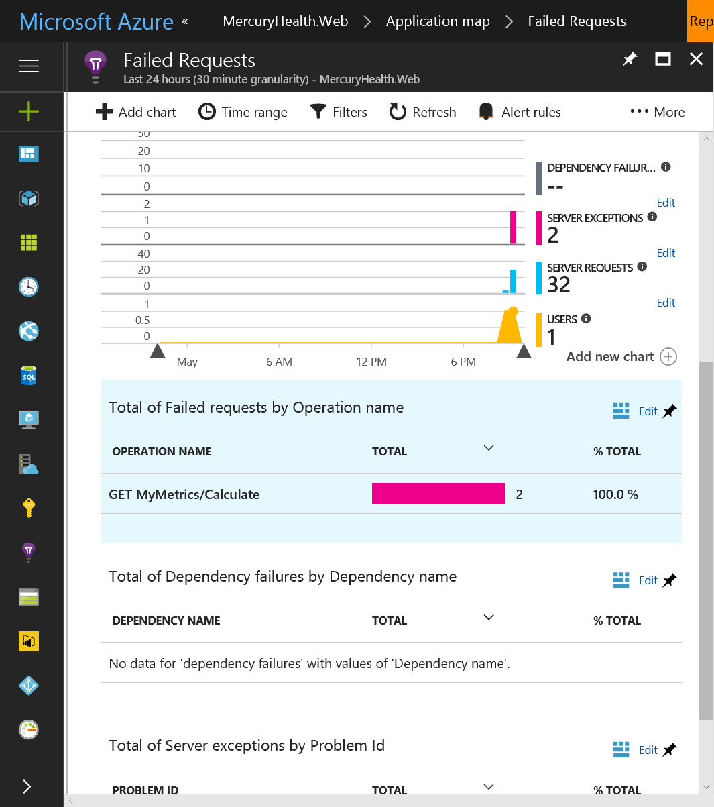

We can see that there have been some failures on the `MyMetrics/Calculate` GET requests.

> NOTE: if there are no failures shown yet, you can make the application fail by navigating to the `/MyMetrics/Calculate` URL, or by clicking **My Metrics** in the app's top menu. Since we've only enabled App Insights on the Staging slot so far, make sure you're browsing the Staging version of the application.

Click through the failures, then select a single failure to investigate more closely.

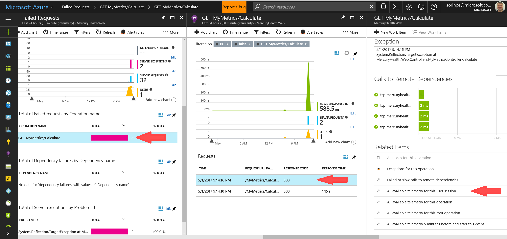

In the single failure blade, you will be able to see:

- Details of the failed request: date and time, URL, client IP address and so on.
- The full stack trace, with an option to create a work item (bug) in either [Visual Studio Team Services](https://www.visualstudio.com/team-services/) or GitHub.
- Calls to remote dependencies, like databases or other services.
- Related telemetry, providing more context about the failure.

In the Related Items section, click **All available telemetry for this user session**. 

This will give you a list of all the operations that user has done during that session, prior to getting the exception. This can be a very powerful troubleshooting tool.

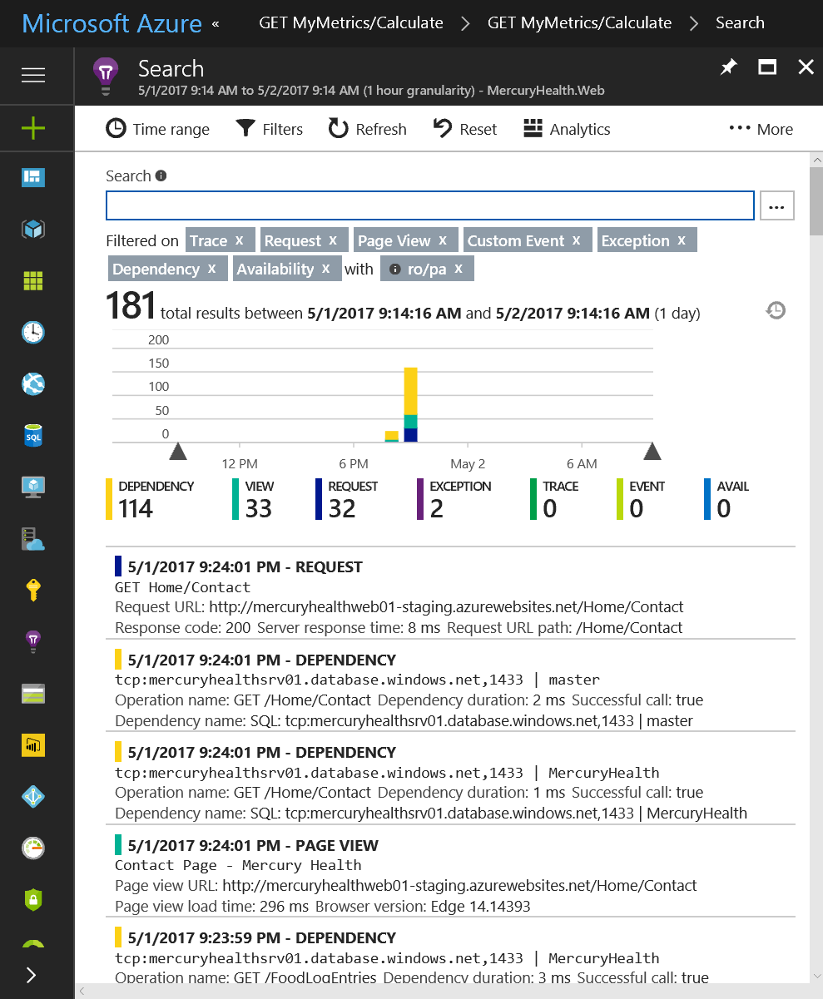

#### Usage data

Usage data shows us easy-to-digest information about our users. You can find out which countries your users are from, what browsers and operating systems they use and which pages they visit most frequently.

To see usage data, navigate to **Usage** from the App Insights dashboard.

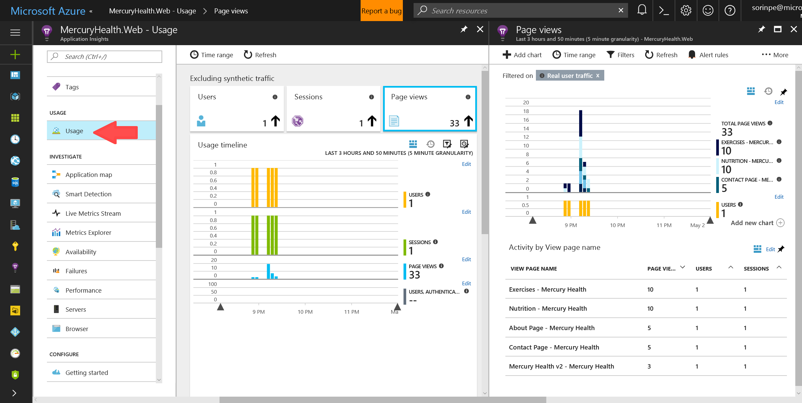

Feel free to click through the various tiles and view the information displayed.

#### Smart detection

[Smart detection](https://docs.microsoft.com/en-us/azure/application-insights/app-insights-proactive-diagnostics) automatically warns you of potential performance problems in your web application. It performs proactive analysis of the telemetry that your app sends to Application Insights. If there is a sudden rise in failure rates, or abnormal patterns in client or server performance, you get an alert. This feature needs no configuration.

To see the Smart detection settings, click the **Smart detection** tile from the App Insights dashboard.

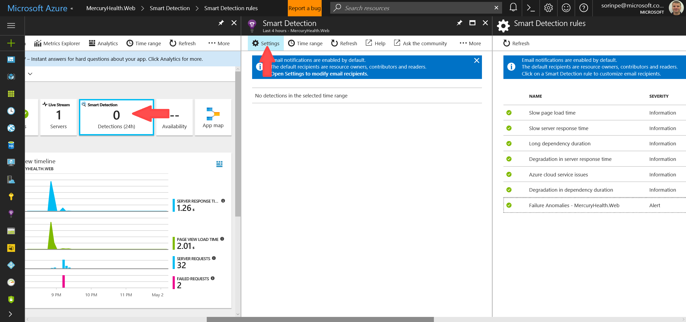

#### Performance data

Performance data in App Insights can show you which pages perform poorly, and why.

To see performance data, click the **Performance** link from the App Insights dashboard.

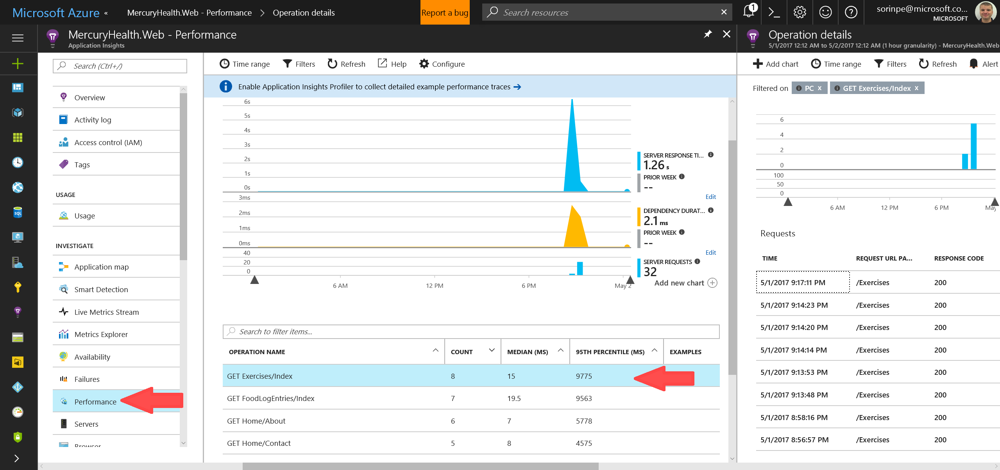

You can click through each slow-performing request, and see a list of dependencies and additional information.

#### Analytics

[Analytics](https://docs.microsoft.com/en-us/azure/application-insights/app-insights-analytics-tour) is an extremely powerful search and visualization technology over Application Insights-collected telemetry.

It offers the ability to write SQL-like queries over all the telemetry your app collects. You can select, filter, group, sort, aggregate, and most of the operations you might be used to perform over any data source.

I strongly recommend to take the [Analytics Tour](https://docs.microsoft.com/en-us/azure/application-insights/app-insights-analytics-tour) in order to understand how to use this powerful feature.

We can explore a few features using our own app. 

> NOTE: if you would like to explore the above features on a large, real-world telemetry dataset, you can use the demo tenant available at https://analytics.applicationinsights.io/demo 

In the App Insighs dashboard, click **Analytics**.

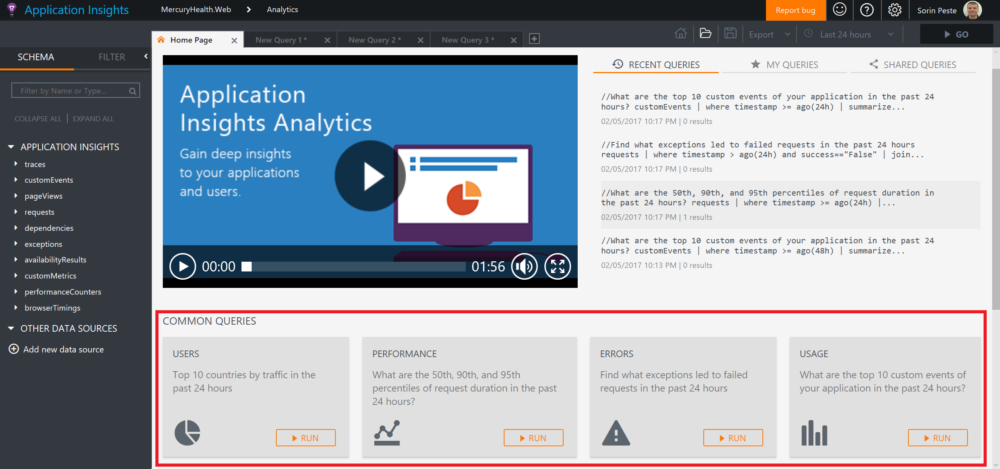

You can click through the Common queries at the bottom to see the results, alter the queries and change the visualization type.

For example, here is the default Performance query, with a slightly altered visualisation:

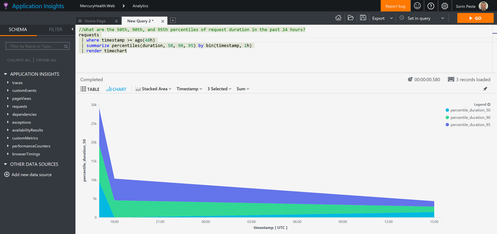

### Optional exercises

1. Check out the full power of Analytics on the [demo tenant](https://analytics.applicationinsights.io/demo). Be sure to look into [Diagnostics](https://docs.microsoft.com/en-us/azure/application-insights/app-insights-analytics-diagnostics), which can help you identify patterns in your app usage, which can explain sudden spikes or drops in performance, error rate, an so on.  
2. Try [setting up your own Alerts](https://docs.microsoft.com/en-us/azure/application-insights/app-insights-alerts). For example, set an alert for when your average Server Response Time stays above 1 second. Check for the alert email.
3. Try looking for your [custom events](https://docs.microsoft.com/en-us/azure/application-insights/app-insights-api-custom-events-metrics). For hints, check the `Controllers/FoodLogEntriesController.cs` file. Can you trigger custom events by using the app? Can you write a query in Analytics which will show you how many custom events of each type you had in the past month?

**Next Step**: [Scaling your application](Scaling.md)

[Back to Index](README.md)