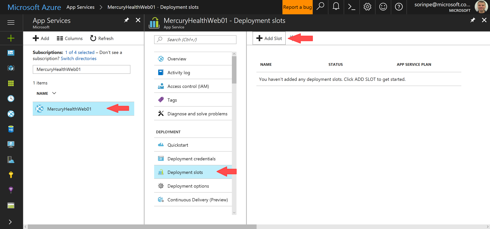

# Azure App Service Walkthrough

[Back to Index](README.md)

## Continuous Delivery

During the [previous section](DeployToAzure.md) we were able to deploy our app quickly and painlessly by using Visual Studio's wizard. However, in the real world, that approach has several drawbacks:

- it's not easily automatable
- the production version of the app was unavailable while a new version was being deployed
- we need an easy way to integrate the process into our DevOps workflow

Fortunately, App Service has us covered. We're going to make use of [deployment slots](https://docs.microsoft.com/en-us/azure/app-service-web/web-sites-staged-publishing) and [Git integration for deployment](https://docs.microsoft.com/en-us/azure/app-service-web/web-sites-deploy) to make deployment work seamlessly with our SCM, and keep the app running while we are deploying new versions.

We're also going to make use of [Swap](https://docs.microsoft.com/en-us/azure/app-service-web/web-sites-staged-publishing#swap-deployment-slots) to get new versions into production without taking the app offline.

### Deploy to Staging

In the [Azure Portal](https://portal.azure.com/), find your App Service and navigate to **Deployment slots**.



Click **Add Slot** to add a new deployment slot.

Enter the name `staging` for the new slot, and also choose to clone the settings from your production slot.


Click **OK** and wait for the staging slot to be created.

Once the slot is up and running, click on it, then in the **Overview** page click the app URL. It should have the form `http://<website_name>-staging.azurewebsites.net/`.

You should see the default `index.html` page, signaling the fact that nothing is deployed in the staging slot yet.


Now we'll set up App Service so we can publish to this slot via Git. 

In the Azure Portal, find the App Service again, and make sure you're on the Staging slot. Then hit **Deployment options**.

Click **Choose source**, then select **Local Git Repository**. Click **OK**.


Now we'll set up the Git credentials. 

Still in the Staging slot settings, click **Deployment credentials**.

Enter a username and password to be used when pushing via Git. Hit **Save**.


We now need to fetch the Git remote URL for this slot.

Navigate to **Properties**, find the **GIT URL** property, and copy its value to your clipboard. It should be something like the HTTPS URL in the screenshot below.


Before we deploy to Staging, let's first make a small change to the application, to verify that our changes are indeed being propagated.

In Visual Studio, open the `MercuryHealth.Web/Views/Home/Index.cshtml` file.

Find the section below:

```
@{
    ViewBag.Title = "Mercury Health";
}
```

Change that to:

```
@{
    ViewBag.Title = "Mercury Health v2";
}
```

Then hit `Ctrl+S` to save the `Index.cshtml` file.

Open a command prompt again, and navigate to the folder containing this repository.

Since we'll want to set up our own local Git repo, let's first remove the GitHub-linked one:

```
rmdir /S .git
.git, Are you sure (Y/N)? Y
```

We'll then initialize our own Git repository, and stage the source code for commit:

```
git init

git add src

git status
```

The last command should list a bunch of files to be committed.

```
Changes to be committed:
  (use "git rm --cached <file>..." to unstage)

        new file:   src/initial/.gitignore
        new file:   src/initial/MercuryHealth.Models/BmrCalculatorOption.cs
        new file:   src/initial/MercuryHealth.Models/CaloricIntakeCalculator.cs
        new file:   src/initial/MercuryHealth.Models/ClassDiagram.cd
        ...
```

Let's go ahead and commit to the local repository:

```
git commit -m "Initial deployment"
```

Now we'll set up the Git URL for the staging slot as a remote repository.

Make sure you replace the below is the one you saved earlier, before running the command:

```
git remote add azure https://<admin@appname>-staging.scm.azurewebsites.net:443/MercuryHealthWeb01.git
```

Now all that's left is to push our local commit to this remote repository:

```
git push azure master
```

You'll get a prompt for credentials - use the ones you set up earlier:


After a while, you'll get these messages from the remote repo:

```
remote: Finished successfully.
remote: Running post deployment command(s)...
remote: Deployment successful.
To https://<admin@appname>.scm.azurewebsites.net:443/MercuryHealthWeb01.git
 * [new branch]      master -> master
```

Refresh the URL for the staging slot in your browser, and your application should pop up:


Seems to work.  But wait - why does the front page say **Web App Slot (Production)**, since we've just deployed to Staging?

If you check the `MercuryHealth.Web/Controllers/HomeController.cs` file, you'll notice that message getting built from a `Web.config`-stored value:

```csharp
    public class HomeController : Controller
    {

        public ActionResult Index()
        {
            ViewBag.Message = "Web App Slot (" + WebConfigurationManager.AppSettings["MyWebSlot"] +")";

            return View();
        }
    ...
    }
```

And indeed, `Web.config` contains that key:

```xml
  <appSettings>
    ...
    <add key="MyWebSlot" value="Production" />
  </appSettings>
```

We don't want to be changing that key every time we deploy to Staging or Production, so we'll just add that to the Staging slot's Application Settings, as a Slot setting:


> NOTE: The Slot setting option will tell App Service to keep that setting for the Staging slot, even if we later switch it into Production. Essentially, we are telling that setting NOT to follow the deployment into Production.

After hitting **Save**, refresh the page:


Now, because what we're going to do next, we actually need to define that setting on the Production slot as well. 

Navigate to the App Service, make sure you're NOT on the Staging slot anymore, and set the key in a similar fashion.


Everything looks good now. Assuming our testing goes well, we are now ready to get this new version of the app into production!

## Swapping the staged deployment into Production

What we're going to to now is essentially [swap](https://docs.microsoft.com/en-us/azure/app-service-web/web-sites-staged-publishing#swap-deployment-slots) the Production and Staging slots. 

Get back on the Staging slot settings in the Azure Portal, go to the **Overview** section and click **Swap**.


Click **OK** to swap Staging and Production.


Once the process is complete, refresh the browser for the Staging slot. You'll notice the old version of the app (the one with the title `Mercury Health`) being shown.


Meanwhile, the URL for the Production slot shows the new v2 version of the app:


Awesome! Now you can get your apps deployed into production automatically and with virtually no downtime.

### Optional exercises

1. Set up [Auto Swap](https://docs.microsoft.com/en-us/azure/app-service-web/web-sites-staged-publishing#configure-auto-swap), so staging deployments are swapped automatically into Production.
2. Pretend there's a problem with the new v2, and [rollback your changes](https://docs.microsoft.com/en-us/azure/app-service-web/web-sites-staged-publishing#to-rollback-a-production-app-after-swap).
3. [Warm up your app](https://docs.microsoft.com/en-us/azure/app-service-web/web-sites-staged-publishing#custom-warm-up-before-swap) before swapping it into Production.

**Next Step**: [Application Instrumentation](AppInstrumentation.md)

[Back to Index](README.md)