# Azure App Service Walkthrough

[Back to Index](README.md)

## Deploy the application to Azure

### Database deployment

To deploy the database we're going to use the [Azure SQL Database](https://azure.microsoft.com/en-us/services/sql-database/) service.

First, we're going to create a SQL Server in that service, then we're going to use SSDT in Visual Studio to deploy our database to it.

In the [Azure Portal](https://portal.azure.com/), click **New**, then enter or select **SQL server (logical server)**.

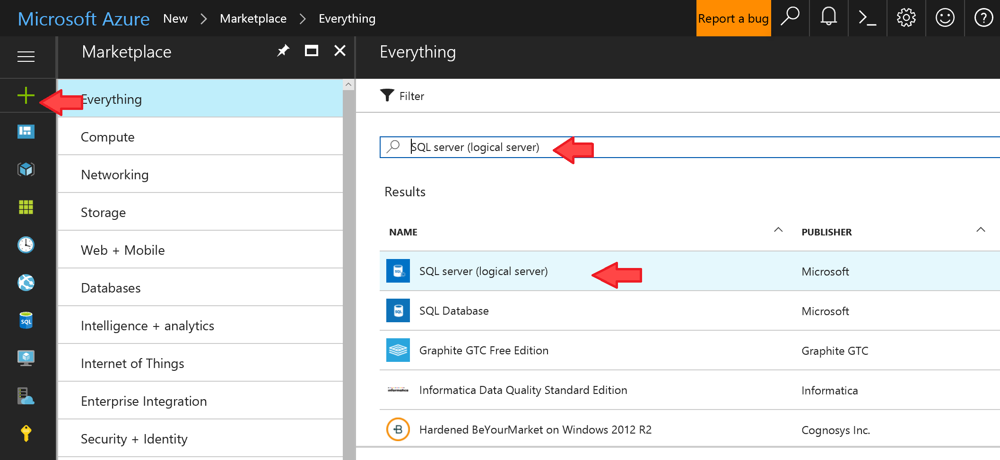

Hit **Create**.

Enter a name for your server, then the admin credentials (keep those somewhere for future reference), a name for the new Resource Group, and a location. Make sure the *Allow azure services to access server* option is checked. Below is an example of filling out this form.

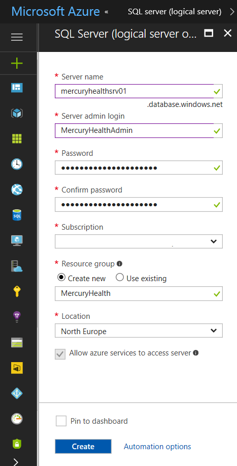

Hit **Create** again, then wait a few minutes for the server to be provisioned.

Once it's up and running, open the **MercuryHealth.sln** solution in Visual Studio.

Right click the **MercuryHealth.Sql** database project and click **Properties**.

Change the project's **Target platform** to **Microsoft Azure SQL Database V12**.

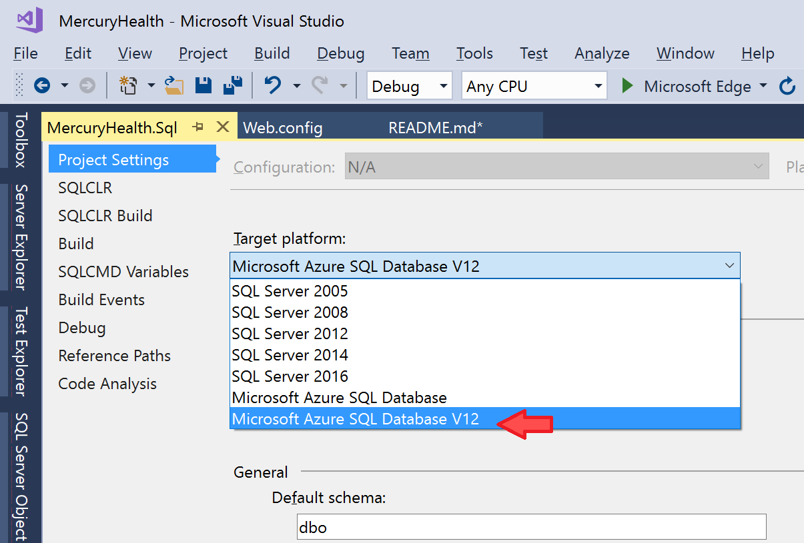

Now, right click the same project and click **Build** to build the database project.

Now it's time to publish it to the Azure SQL Server we just created. Right click the project again, and hit **Publish**.

In the **Publish Database** dialog box, hit **Edit** to edit the target database connection. 

Fill in the server address, username and password, make sure to use SQL Server Authentication, and leave the database name blank (for now).

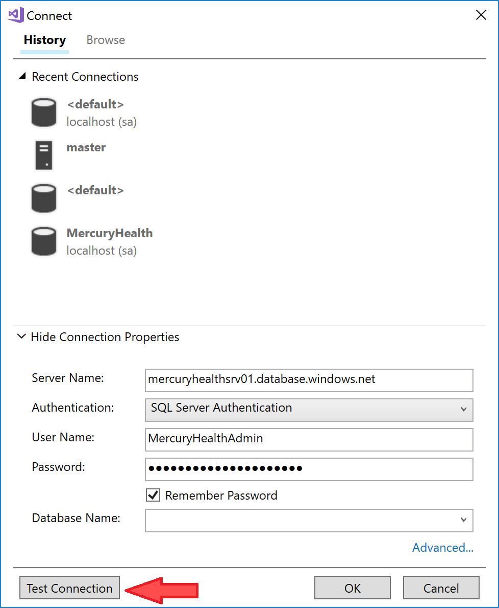

Hit **Test Connection**. The wizard should prompt you to open the Azure SQL Server's firewall to your public IP (all non-Azure IPs are blocked by default).

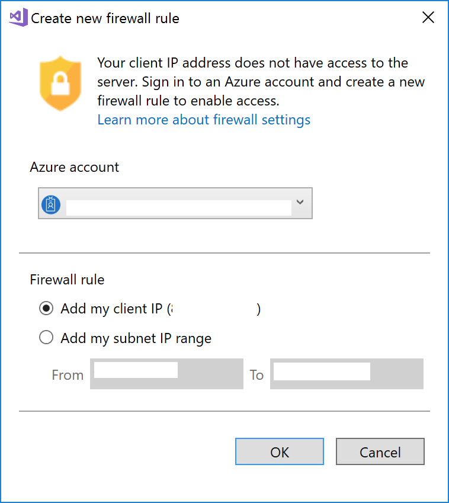

Afterwards, the Test Connection should be successful.

Back in the **Publish Database** dialog box, fill in the database name with **MercuryHealth**. 

  >As an option, you can save the profile as an xml file to use later. 

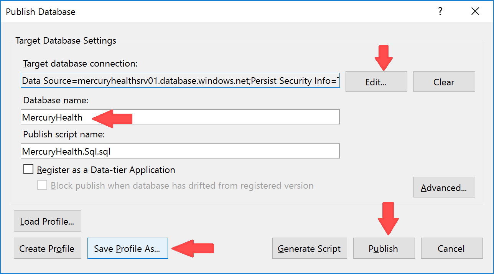

Finally, hit **Publish** to publish the database to Azure.

Check the output window for any errors in the publish process.

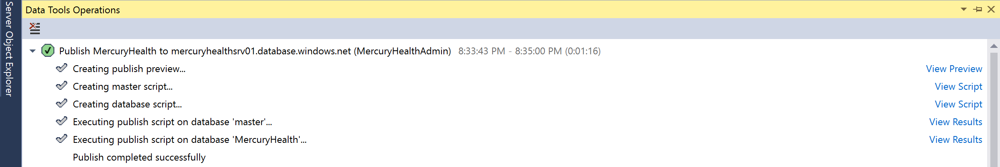

The database part is done; now it's time to take care of the web app.

### Web Application deployment

In order to deploy the web app to [Azure App Service](https://azure.microsoft.com/en-us/services/app-service/), we're going to use the Visual Studio Publish wizard, which will create everything for us, including the App Service resource.

In Visual Studio, right click the **MercuryHealth.Web** project and hit **Publish**.

Select **Microsoft Azure App Service**, and then click **Publish** to create a new App Service.

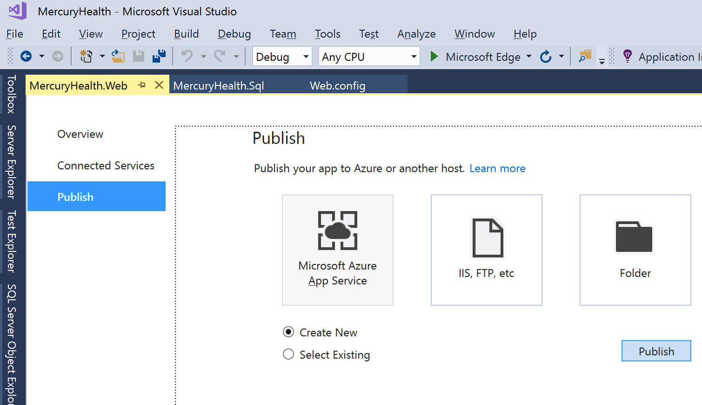

Enter a new name for the web app (must be unique!).

Select the same Resource Group you created with the SQL Server in Azure.

Click **New** to create a new App Service Plan.

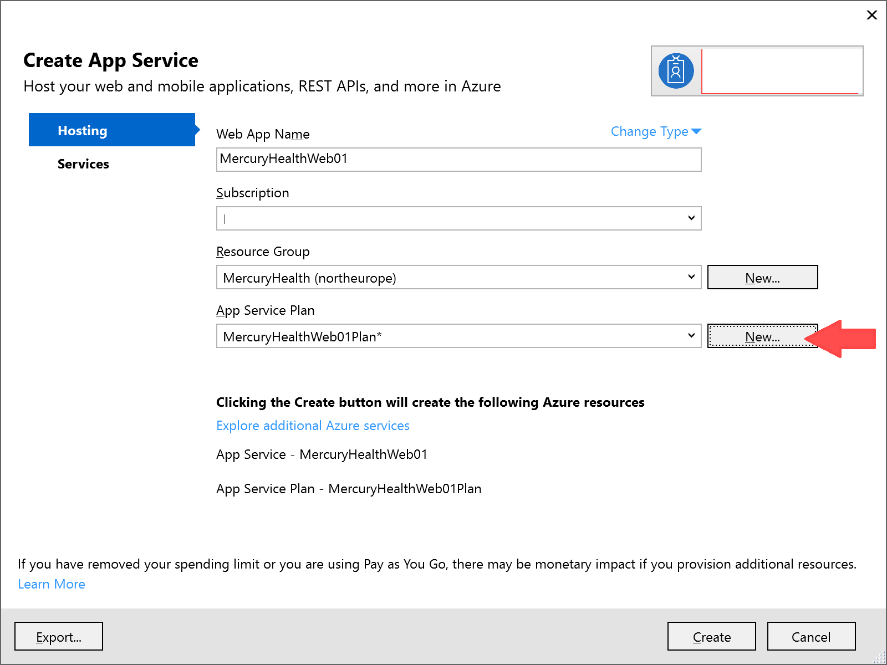

Enter a name for the new App Service Plan.

Select a location - it's best to choose the same Azure region as the SQL Server, for minimal latency.

For the Size, choose **S1**.

> While you could also select the **Free** plan, some of the App Service features we'll examine in this walkthrough require the **Standard** plan or better. You can downgrade to Free later, or even delete the entire deployment when you're done.

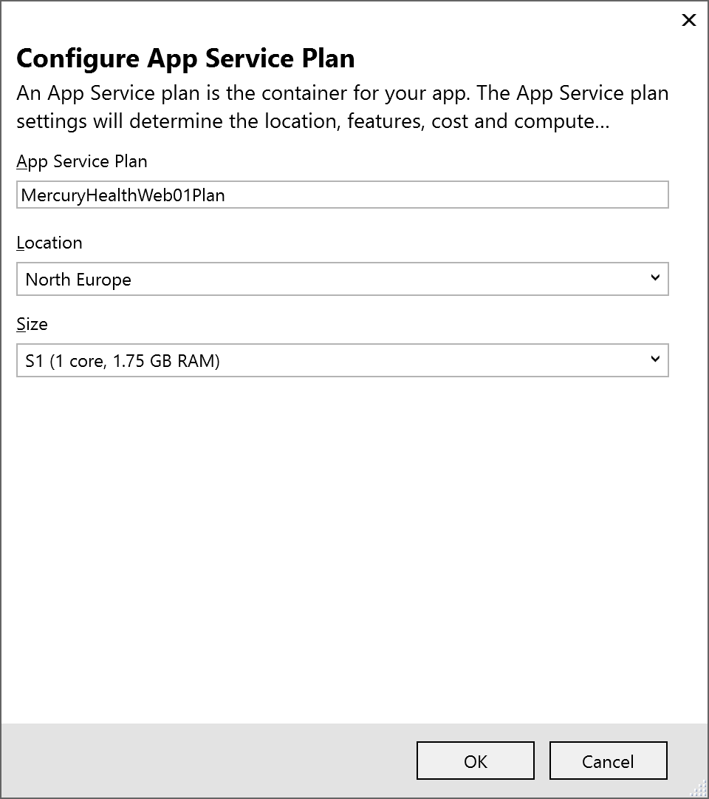

Hit **Publish** and wait for the app to publish.

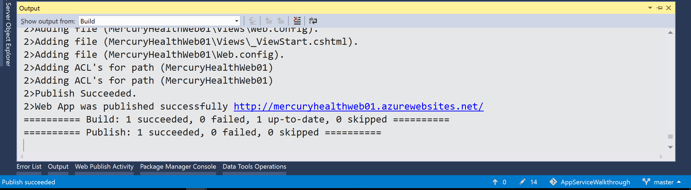

Once the publish process is done, you might get to see a browser window pop up with your new public website. Success! 

...Or is it?

If you click some of the links in the application top menu (for example, *Exercises*), you'll eventually get an error that the app cannot connect to SQL Server:

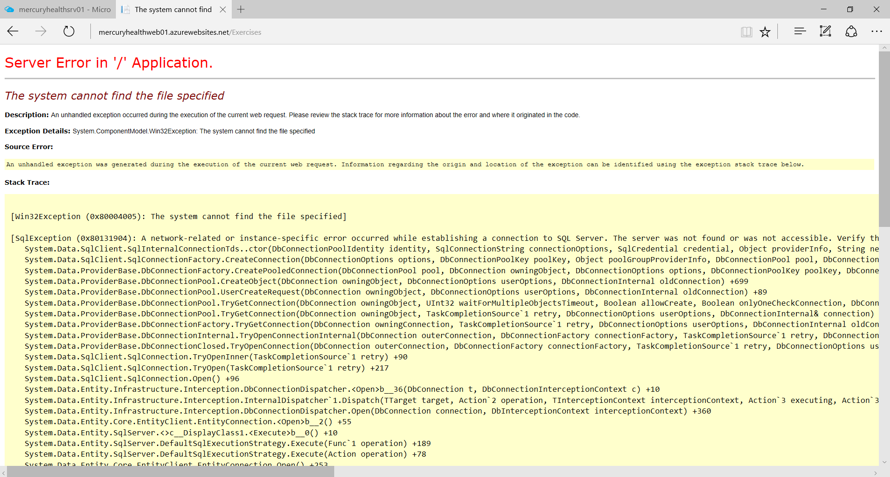

Which makes perfect sense, since we forgot to change the connection string in **Web.config**:

```xml
  <connectionStrings>
    <add name="DefaultConnection" connectionString="Data Source=localhost;Initial Catalog=MercuryHealth;Integrated Security=True;Connect Timeout=30;Encrypt=False;TrustServerCertificate=False;ApplicationIntent=ReadWrite;MultiSubnetFailover=False" providerName="System.Data.SqlClient" />
  </connectionStrings>
```

While we *could* just change this connection string to point to Azure SQL Database and re-publish, this might become a problem if later we accidentally commit this file to source control, since it might contain sensitive access credentials. 

Fortunately, App Service allows us to override this setting in the cloud, so we don't have to save credentials in text files. This also makes deployment of multiple versions of the application (dev/test/production) easier.

In the Azure Portal, navigate to the SQL Database you created. 

In the Overview pane, click **Show database connection strings**.

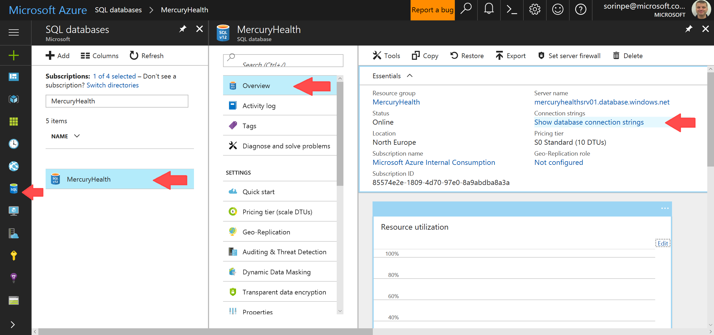

Copy the ADO.NET connection string to your favorite text editor. Then edit the connection string with the correct User Id and Password.

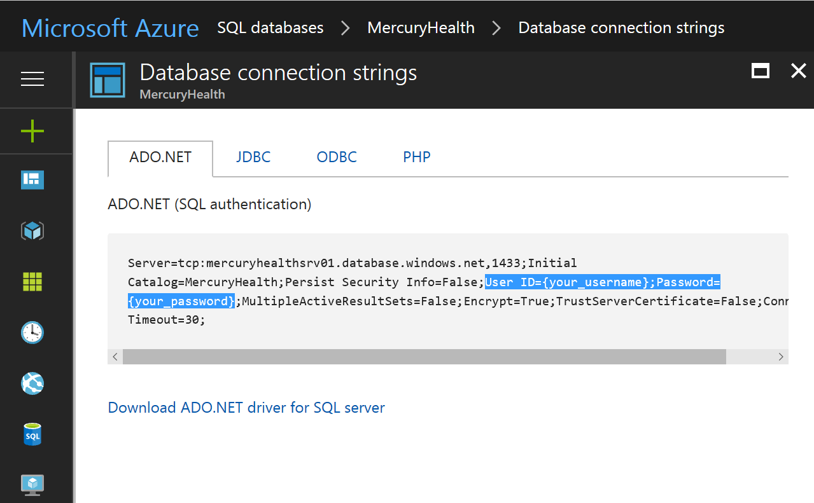

In the Azure Portal, navigate to the App Service you created.

In the **Application settings** pane, scroll down until you find the **Connection strings** section. 

Enter a new connection string. The Name should be `DefaultConnection`, the same name we have in Web.config. The value should be the connection string to Azure SQL Database, filled in with the correct User id and Password.

Hit **Save** to save the new connection.

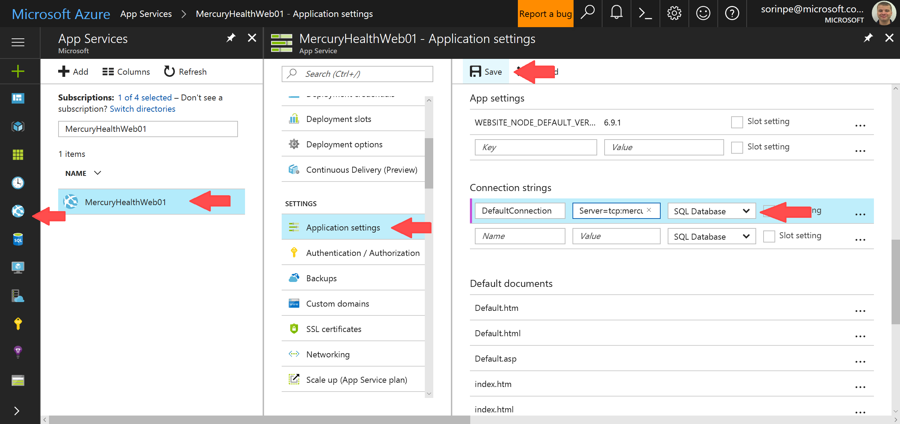

Now refresh the browser and your app should work fine in Azure!

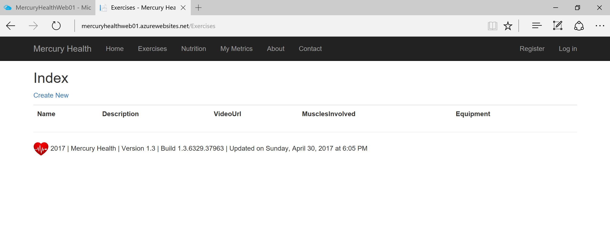

**Next Step**: [Continuous Delivery](ContinuousDelivery.md)

[Back to Index](README.md)