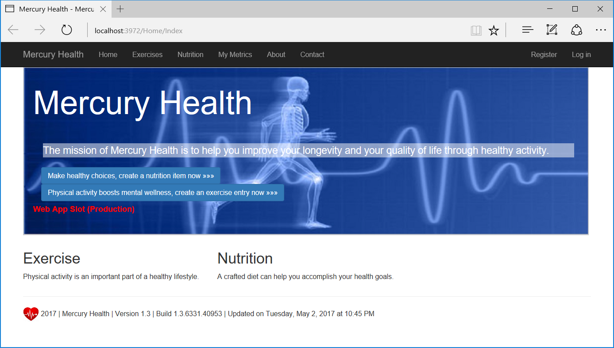
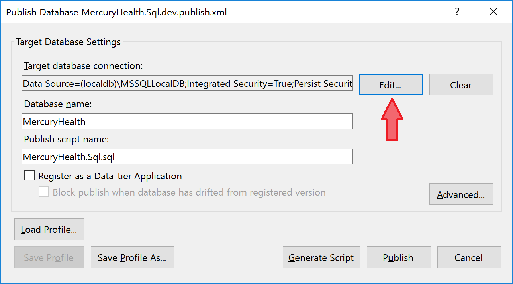
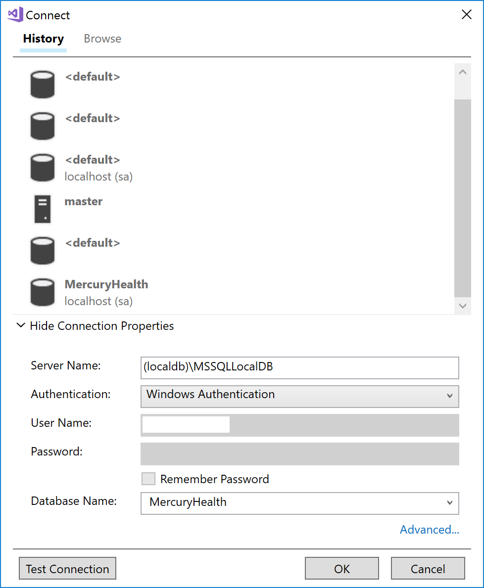

# Azure App Service Walkthrough

## Abstract

We're often told that one big reason to consider the cloud is because a lot of the headaches of management and operations can be taken care of for us. 

Things like Autoscaling, Continuous Deployment, Staging slots, Monitoring, Failover may not come as a completely free lunch, but you CAN get them at a significant discount - of your time, effort, and money. 

I've put together this walkthrough in order to showcase how [Azure App Service](https://azure.microsoft.com/en-us/services/app-service/) can help you meet those requirements for your app - so you can sleep better at night, knowing that your app is always there, online, helping your users quickly and efficiently. 

## Table of Contents

1. [So what exactly is Azure App Service and why should I bother?](#whatis)
2. [What you'll need](#reqs)
3. [Get the code](#code)
4. [Our Demo Application](#app)
5. [Test the application locally](#local)
6. [Deploy the application to Azure App Service](DeployToAzure.md)
7. [Continuous Delivery](ContinuousDelivery.md)
8. [Application Instrumentation](AppInstrumentation.md)
9. [Scaling your application](Scaling.md)

<a name="whatis"/>

## So what exactly is Azure App Service and why should I bother?


*(this section borrows heavily from the [official docs](https://docs.microsoft.com/en-us/azure/app-service/app-service-value-prop-what-is))*

[Azure App Service](https://azure.microsoft.com/en-us/services/app-service/) is a platform-as-a-service (PaaS) offering of [Microsoft Azure](https://azure.microsoft.com/en-us/). 

Create web and mobile apps for any platform or device. Integrate your apps with SaaS solutions, connect with on-premises applications, and automate your business processes. Azure runs your apps on fully managed virtual machines (VMs), with your choice of shared VM resources or dedicated VMs.

App Service includes the web and mobile capabilities that Azure previously delivered separately as Azure Websites and Azure Mobile Services. It also includes new capabilities for automating business processes and hosting cloud APIs. As a single integrated service, App Service lets you compose various components -- websites, mobile app back ends, RESTful APIs, and business processes -- into a single solution.

Here are some key features and capabilities of App Service:

* **Multiple languages and frameworks** - App Service has first-class support for ASP.NET, Node.js, Java, PHP, and Python. You can also run [Windows PowerShell and other scripts or executables](https://docs.microsoft.com/en-us/azure/app-service-web/web-sites-create-web-jobs.md) on App Service VMs.
* **DevOps optimization** - Set up [continuous integration and deployment](https://docs.microsoft.com/en-us/azure/app-service-web/app-service-continuous-deployment.md) with Visual Studio Team Services, GitHub, or BitBucket. Promote updates through [test and staging environments](https://docs.microsoft.com/en-us/azure/app-service-web/web-sites-staged-publishing.md). Perform [A/B testing](https://docs.microsoft.com/en-us/azure/app-service-web/app-service-web-test-in-production-get-start.md). Manage your apps in App Service by using [Azure PowerShell](/powershell/azureps-cmdlets-docs) or the [cross-platform command-line interface (CLI)](https://docs.microsoft.com/en-us/azure/cli-install-nodejs.md).
* **Global scale with high availability** - Scale [up](https://docs.microsoft.com/en-us/azure/app-service-web/web-sites-scale.md) or [out](https://docs.microsoft.com/en-us/azure/monitoring-and-diagnostics/insights-how-to-scale.md) manually or automatically. Host your apps anywhere in Microsoft's global datacenter infrastructure, and the App Service [SLA](https://azure.microsoft.com/support/legal/sla/app-service/) promises high availability.
* **Connections to SaaS platforms and on-premises data** - Choose from more than 50 [connectors](https://docs.microsoft.com/en-us/azure/connectors/apis-list.md) for enterprise systems (such as SAP, Siebel, and Oracle), SaaS services (such as Salesforce and Office 365), and internet services (such as Facebook and Twitter). Access on-premises data using [Hybrid Connections](https://docs.microsoft.com/en-us/azure/biztalk-services/integration-hybrid-connection-overview.md) and [Azure Virtual Networks](https://docs.microsoft.com/en-us/azure/app-service-web/web-sites-integrate-with-vnet.md).
* **Security and compliance** - App Service is [ISO, SOC, and PCI compliant](https://www.microsoft.com/TrustCenter/).
* **Application templates** - Choose from an extensive list of templates in the [Azure Marketplace](https://azure.microsoft.com/marketplace/) that let you use a wizard to install popular open-source software such as WordPress, Joomla, and Drupal.
* **Visual Studio integration** - Dedicated tools in Visual Studio streamline the work of creating, deploying, and debugging.

<a name="reqs"/>

## What you'll need

To go through the entire material, you will need:

1. A computer with Windows 7, Windows 8.1 or Windows 10 installed.
2. Visual Studio 2015 or 2017. You can download the free Community Edition [here](https://www.visualstudio.com/vs/community/).
3. SQL Server Data Tools. Get them from [here](https://docs.microsoft.com/en-us/sql/ssdt/download-sql-server-data-tools-ssdt).
4. A Microsoft Azure subscription. You can get a [free 30-day trial](https://azure.microsoft.com/en-us/free/), or you can get a one-year free subscription via [Visual Studio Dev Essentials](https://www.visualstudio.com/dev-essentials/) (25 USD / month currently).

<a name="code"/>

## Get the code

Open a command window and navigate to a folder of your choice.

Now clone this repository:

```
git clone https://github.com/neaorin/AppServiceWalkthrough.git
```

Navigate to the `AppServiceWalkthrough` folder.

```
cd AppServiceWalkthrough
```

Now open Visual Studio, and open the `src\initial\MercuryHealth.sln` solution file. Build the solution.

<a name="app"/>

## Our Demo Application

For this walkthrough we're going to use [MercuryHealth](https://github.com/abelsquidhead/MercuryWeb), a web app whose mission is to help you improve your longevity and your quality of life through healthy activity!



Well, almost. This app was actually put together by two Microsoft guys, [Abel Wang](https://twitter.com/AbelSquidHead) and [Randy Pagels](https://twitter.com/randypagels) to act as a demo app for their awesome [DevOps Nirvana with VSTS and Azure](http://abelsquidhead.com/index.php/2016/04/06/setting-up-a-devops-demo-using-vsts-and-azure-or-devops-nirvana-with-vsts-and-azure-part-1/) series. 

All credit for the MercuryHealth app goes to them. 

The code we're going to use is a stripped down version of MercuryHealth. The solution contains three projects:

- `MercuryHealth.Models` - .NET Class Library containing model classes
- `MercuryHealth.Sql` - [SQL Server Data Tools](https://msdn.microsoft.com/en-us/library/hh272686(v=vs.103).aspx) project containing the database
- `MercuryHealth.Web` - [ASP.NET MVC](https://www.asp.net/mvc) project containing the web application.

<a name="local"/>

## (Optional) Test the application locally

If you'd like to test the application on your local machine first, before deploying it onto the cloud, read on. Otherwise, you can skip right to [Deploying the application to Microsoft Azure](DeployToAzure.md).

In order to test the web application locally, the first step is to deploy the database.

You will need to have SQL Server up and running, either on your local machine or on a remote server. 

I would say that today the two easiest ways to get SQL Server running locally is to either 

a) [use LocalDB](https://docs.microsoft.com/en-us/sql/database-engine/configure-windows/sql-server-2016-express-localdb) or
b) [use Docker](https://docs.microsoft.com/en-us/sql/linux/sql-server-linux-setup-docker).

If you've installed Visual Studio 2015 or 2017, it's likely that you already have LocalDB installed. The web application is already configured to use the default automatic instance of LocalDB (see the `Web.config` file):

```xml
  <connectionStrings>
    <add name="DefaultConnection" connectionString="Data Source=(localdb)\MSSQLLocalDB;Initial Catalog=MercuryHealth;Integrated Security=True;Connect Timeout=30;Encrypt=False;TrustServerCertificate=False;ApplicationIntent=ReadWrite;MultiSubnetFailover=False" providerName="System.Data.SqlClient" />
  </connectionStrings>
```

If you don't have LocalDB installed, download [SQL Server Express Edition](https://www.microsoft.com/en-us/sql-server/sql-server-downloads) and during the installation wizard select the option to install LocalDB.

If you'd rather use SQL Server Express Edition, SQL Server Developer Edition, [the SQL Server Docker image](https://hub.docker.com/r/microsoft/mssql-server-linux/) or some other version of SQL Server, make sure to alter the connection during the database deployment step (see below), and change the `Web.config` file as needed.

### Deploy the database locally

In Visual Studio, right click the **MercuryHealth.Sql** database project and click **Build** to build the database project.

Now it's time to publish it to your local SQL Server (LocalDB or whatever you're using). Right click the project again, and hit **Publish**.

In the **Publish Database** dialog box, hit **Edit** to edit the target database connection. 

Fill in the server address and authentication (for LocalDB it should be Windows, for Docker images it should be SQL). The database name should be **MercuryHealth**.

Below is an example if you're using LocalDB.





Finally, hit **Publish** to publish the database to SQL Server.

Check the output window for any errors in the publish process.

### Run the web app locally

Right click the **MercuryHealth.Web** project, and select **Set as StartUp Project**.

Double check the database connection string inside `Web.config` - make sure it points to the right database you just deployed.

```xml
  <connectionStrings>
    <add name="DefaultConnection" connectionString="Data Source=(localdb)\MSSQLLocalDB;Initial Catalog=MercuryHealth;Integrated Security=True;Connect Timeout=30;Encrypt=False;TrustServerCertificate=False;ApplicationIntent=ReadWrite;MultiSubnetFailover=False" providerName="System.Data.SqlClient" />
  </connectionStrings>
```

Then, hit F5 to run the project - or CTRL + F5 to run it without debugging.

You should see the MercuryHealth app running locally in IIS Express.


Feel free to click through some of the menu options, like *Exercises*, *Nutrition*, *About* etc.

**Next Step**: [Deploy the application to Azure App Service](DeployToAzure.md)

[Back to Index](README.md)