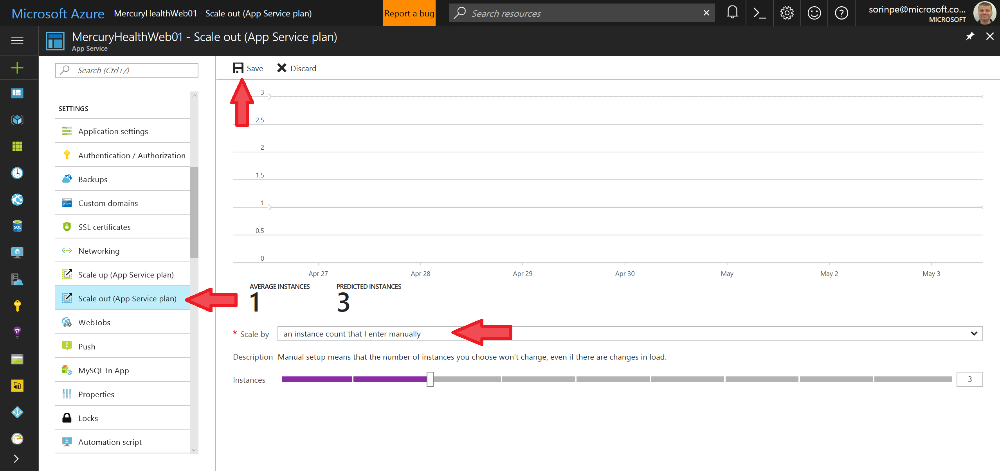
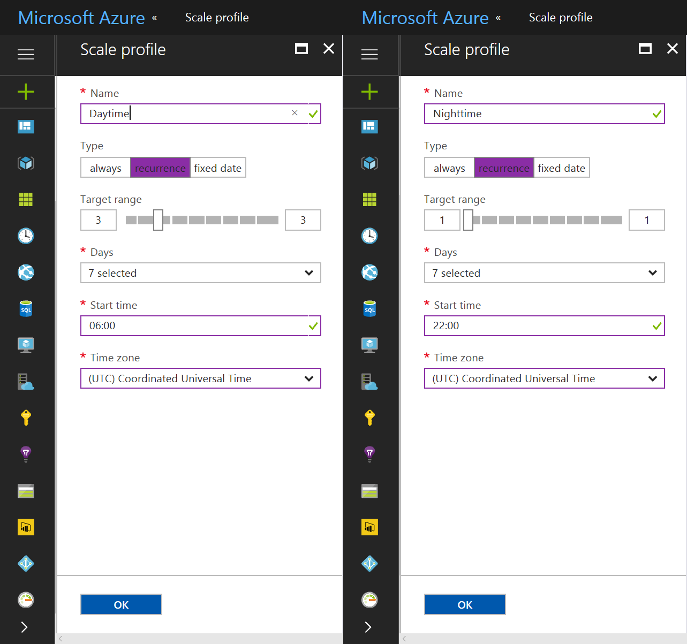
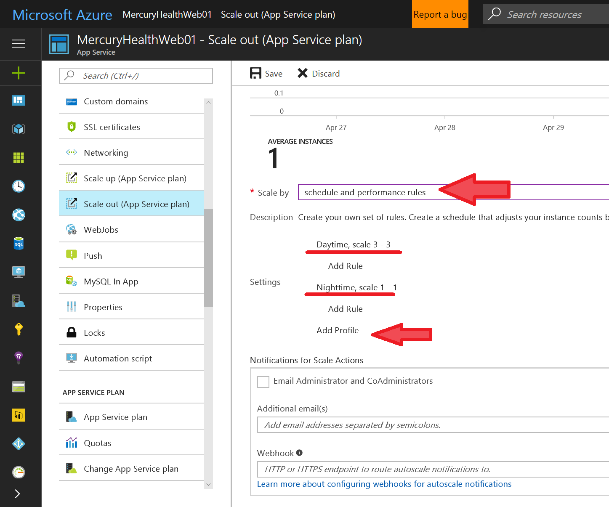
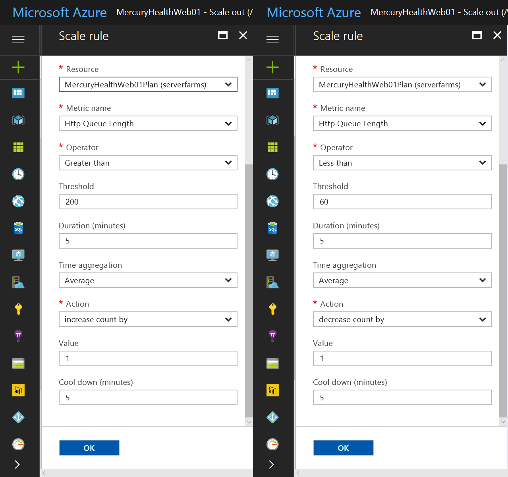
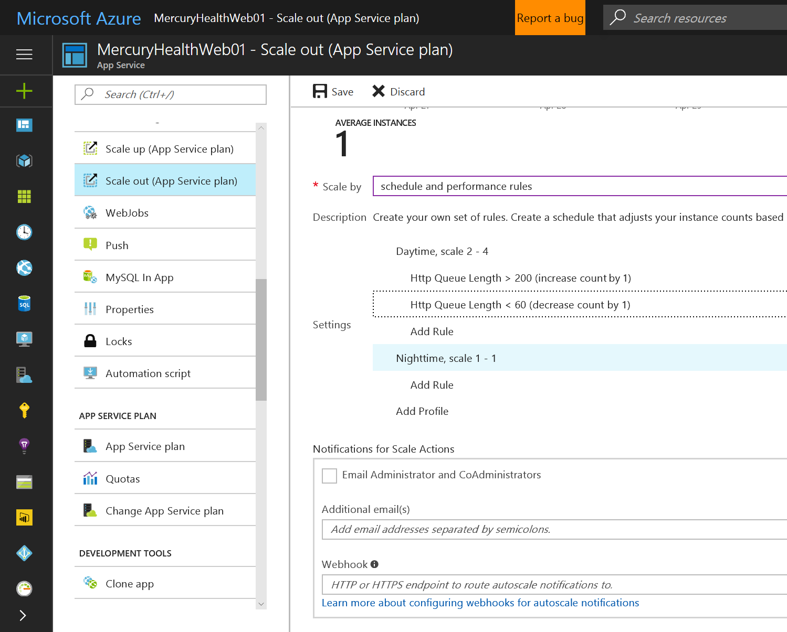

# Azure App Service Walkthrough

[Back to Index](README.md)

## Scaling your application

### Manual scaling

In the [Azure Portal](https://portal.azure.com/), find your App Service and navigate to **Scale out (App Service Plan)**.

Move the **Scale by** slider from 1 to 3, then hit **Save**. 

After a few seconds, you'll have 3 instances running your application instead of the original 1. 

> NOTE: Multiple instances have load balancing built-in, so by default multiple requests from the same user will hit different servers. However, if your application requires it, you can set the [ARR Affinity](https://blogs.msdn.microsoft.com/benjaminperkins/2016/06/03/setting-application-request-routing-arr-affinity-for-your-azure-app-service/) option in Application Settings, so your user will always hit the same server during their session. This is usually the case with apps who store session state in the server's RAM - although you can always use SQL Database or [Redis Cache](https://docs.microsoft.com/en-us/azure/redis-cache/cache-aspnet-session-state-provider) instead.

### Scaling on a schedule

Let's pretend that our app targets users from a specific geographic region - say, only users in France or the UK. This means that our usage is pretty high during the day (6:00 - 22:00) but tapers off at night (22:00 - 6:00).

It would therefore be great if we could optimize our costs by using fewer instances during the night, than during the day. For example, we might run 3 instances (S1 size) during daytime hours, but go down to just one instance at night time.

Let's assume a 31-day month. So, if we were running 3 instances all the time, that's 31 days * 24 hours * 3 instances = **2,232 instance hours** per month.

But on our cost-saving plan, that's 31 days * 16 hours * 3 instances = 1,488 instance hours for the daytime usage. 

And we'll only have 31 days * 8 hours * 1 instance = 248 instance hours for the night time usage.

That brings our App Service consumption to **1,736 instance hours** per month, which is **22.2 percent savings**!

Fortunately, App Service makes this extremely easy to set up.

In the **Scale out** screen:

- Select **Scale by schedule and performance rules**.
- Click **Add Profile**.
- Add a profile called **Daytime**, which kicks in at 06:00 every morning, with a target instance range of 3-3.
- Add another profile called **Nighttime**, which kicks in at 22:00 every evening, with a target instance range of 1-1.

After all the changes, this is how your rules should look like.

Hit **Save** to save your profile. 

You're done! Now your app will scale automatically out and in, twice a day!

### Autoscaling based on user demand

Now, the above setup is pretty nice... but what if our daytime usage is not constant, and has *spikes* and *gullies* which we can't reliably predict? Can we optimize our infrastructure by matching our instance count to the demand, without letting costs get out of control?

The answer is yes. What we can do is add performance rules into the mix.

For example, instead of always running 3 instances during the day, we can allow App Service to decide to run between 2 and 4 instances at any one time - and base that decision on some metric. 

It could be CPU usage, RAM usage, the amount of Data in / out, and so on. 

However for this example, we're going to do it based on the length of the HTTP request queue. 

Requests coming into App Service will either be passed onto web server workers, or put into a queue if all workers are busy at that time. After a while, if no workers become free, the queued request is dropped. 

An HTTP queue getting larger is an indication of increased activity which your infrastructure can't handle on the current capacity. Conversely, a near-zero HTTP queue length for a period of time can mean that your infrastructure is under-used.

So, let's set this up. 

In the **Scale out** screen:

- Modify the **Daytime** profile, setting a target instance range of 2-4.
- Add a new rule to the **Daytime** profile, to *increase* instance count by 1 whenever the HTTP Request Queue average goes above 200.
- Add a new rule to the **Daytime** profile, to *decrease* instance count by 1 whenever the HTTP Request Queue average goes below 60.

> NOTE: The 200 and 60 values are only examples. You'll need to decide which values work best here, you can [monitor the value](https://docs.microsoft.com/en-us/azure/app-service-web/web-sites-monitor) you're interested in over a period of time - in this case, the HTTP Queue Length.

This is how your scale plan should look like when you're done.

### Optional exercises

1. Test your autoscale setup by [running a performance test](https://www.visualstudio.com/en-us/docs/test/performance-testing/app-service-web-app-performance-test) on your App Service. You can set up email notifications on the **Scale out** screen.

[Back to Index](README.md)